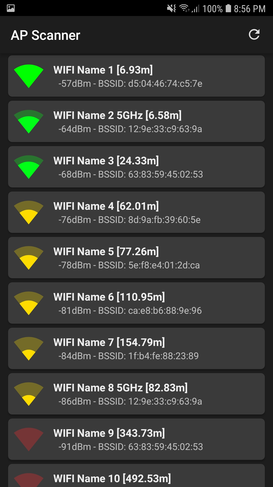

# WiFi Acess Point Distance Calculator
A simple Android application that calculates and displays the distance to all nearby WiFi routers

The Distance is measured using RSSI. The list refreshes every 4 seconds automatically.

This app was created simply to test code and gather information for another project: [Indoor-Navigation](https://github.com/shaunferns26/Indoor-Navigation)

### Screenshot

    
     
    App Screenshot

